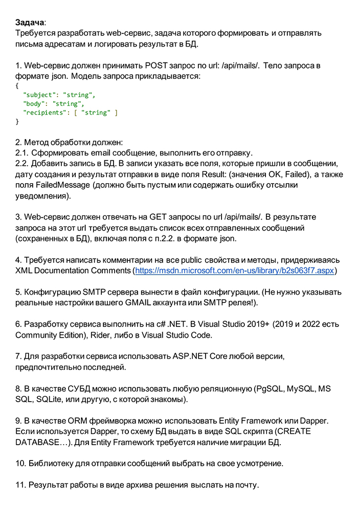

# WebApiEmailService-test

Веб-сервис написан на C# с помощью ASP.NET Core 6 WebApi.

Отсылает электронные письма используя [MailKit](https://www.nuget.org/packages/MailKit/).

Данные для электронного письма получает в виде JSON (POST запрос).

Реализована валидация данных и логирование в БД (Entity Framework Core 6).

Для проверки работоспособности необходимо:
1. dotnet ef database update
2. В файле appsettings.json ввести свои данные для Gmail (поля From, Username, Password  в секции EmailConfiguration)

Более подробно задание описано ниже:

#

#

Использовались Microsoft Visual Studio 2022, Postman.